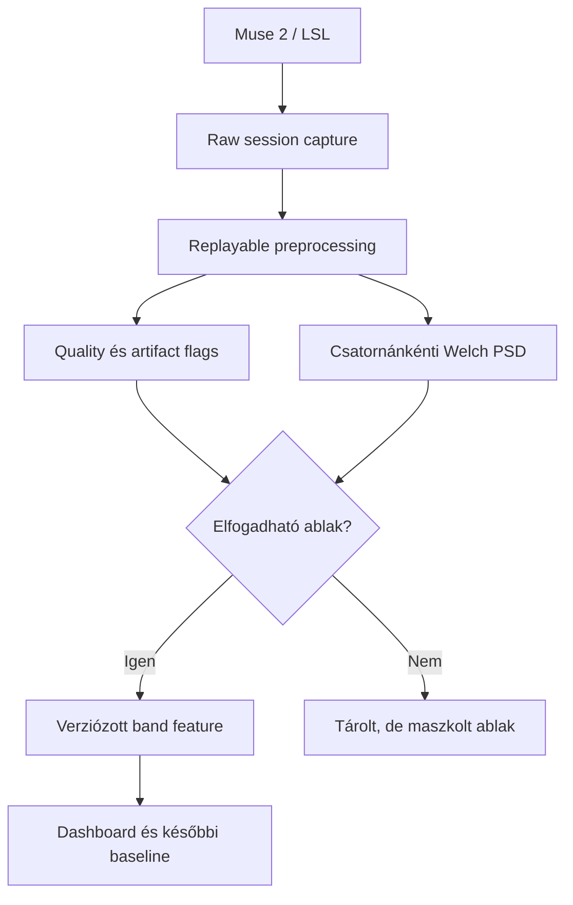

# SenseLayer – Signal Pipeline Validation

**Státusz:** implementáció előtti validációs terv  
**Dátum:** 2026-08-30  
**Auditált repository:** `vincze-tamas/senselayer`  
**Auditált commit:** `1fd3a5cca99491b857b5dd0633a1700a982cccd7`  
**Döntési cél:** eldönteni, hogy a Muse 2-ből számított frekvenciasávok elég megbízhatók-e személyes baseline építéséhez.

## 1. Vezetői döntés

A Milestone 3 – személyes baseline és normalizált metrikák – **még ne induljon el**. Előtte egy külön, szűk **Signal Pipeline Validation** mérföldkő szükséges.

Ennek oka nem az, hogy a baseline iránya hibás, hanem hogy a jelenlegi feature pipeline még nem választja szét kellő biztonsággal:

- a valódi alacsony frekvenciás EEG-aktivitást;
- a lassú elektróda-/kontakt-sodródást;
- a pislogás és szemmozgás homloki hatását;
- az izomeredetű zajt;
- az adatkapcsolati hiányokat.

Hibás feature-ökre épített baseline a zajt is stabil személyes mintává alakíthatná. Ettől a rendszer konzisztensnek látszana, de nem válna megbízhatóbbá.

## 2. Bizonyított jelenlegi állapot

### 2.1. Band power számítás

A `scripts/muse2_edge_collector.py` jelenleg:

1. 2 másodpercnyi, 256 Hz-es, négycsatornás ablakot használ;
2. csatornánként átlagot von le;
3. Hann-ablakot alkalmaz;
4. egyetlen `rFFT` periodogramot számol;
5. a csatornák sávenergiájának mediánját veszi;
6. az öt sávot úgy normalizálja, hogy összegük 1 legyen.

Ezért például a `delta=0.8` nem abszolút delta-amplitúdót jelent, hanem azt, hogy az algoritmus által figyelembe vett 0,5–45 Hz-es összenergia 80%-át a delta tartományba sorolta.

### 2.2. Fő technikai vakfoltok

- A 2 másodperces egyetlen periodogram instabil becslés, különösen a delta tartományban.
- Nincs kontrollált high-pass szűrés vagy lineáris detrending a lassú sodródás ellen.
- A minőségmodell nem tartalmaz külön lassú-drift, pislogás- vagy szemmozgás-detektort.
- A négy csatorna mediánja egyetlen globális értékké mossa össze a homloki és temporális eltéréseket.
- Az LSL timestampet a collector eldobja, így nem ellenőrzi a tényleges mintavételi időzítést és a mintakimaradást.
- A rossz minőségű feature-ök eltárolhatók és megjelennek a history grafikonon.
- A Streamlit grafikon a hosszú adatkimaradást egyenes vonallal köti össze.
- Raw EEG nincs eltárolva, ezért a korábbi mérés új algoritmussal nem dolgozható fel újra.

### 2.3. Ami már jó alap

- A quality pipeline determinisztikus és külön modulban van.
- A feature-ek 0–1 tartományú szerződése és receiver-validációja létezik.
- A session, event marker, export és verziózott release-folyamat jó alapot ad a kontrollált protokollhoz.
- A valós Muse kontaktvesztés/helyreállás acceptance teszt már bizonyította az adatút működését.

## 3. A mérföldkő határai

### Benne van

- rövid, sessionhöz kötött raw EEG rögzítés és determinisztikus replay;
- időzítés- és gap-validáció;
- több előfeldolgozási/PSD-konfiguráció összehasonlítása;
- csatornánkénti abszolút és relatív sávfeature-ök;
- artefaktumok detektálása és feature-gating;
- quality-aware history megjelenítés;
- szintetikus és valós Muse acceptance protokoll;
- algoritmusverzió és konfigurációs provenance.

### Nincs benne

- személyes baseline létrehozása;
- Focus/Relaxation pontszám újratervezése;
- neurofeedback;
- diagnosztikai, stressz- vagy érzelemállítás;
- ICA vagy artefaktum „javítása”;
- folyamatos, korlátlan raw EEG archiválás;
- teljes Windows tray alkalmazás.

## 4. Célarchitektúra

Alapelv: **a raw adat megmarad a validációs sessionhöz, a feature újraszámítható, a rossz ablak nem tűnik el, de nem jelenhet meg megbízható agyi jelként.**

## 5. Végrehajtási terv

### Kártya 1 – Raw capture és replay contract

**Cél:** ugyanazt a rövid Muse-felvételt több algoritmusváltozattal, azonos eredménnyel lehessen újrafuttatni.

**Tervezett tartalom:**

- Sessionhöz kötött, opt-in raw capture, alapértelmezetten kikapcsolva.
- Tárolt mezők:
  - LSL timestamp;
  - fogadási timestamp;
  - TP9, AF7, AF8, TP10 raw érték;
  - deklarált és becsült sample rate;
  - eszköz-/forrásazonosító;
  - collector commit és pipeline verzió;
  - csatornasorrend;
  - mérési protokoll és event markerek.
- Rövid sessionökhöz tömörített `NPZ` vagy Parquet spike; a formátumról mért méret és replay-egyszerűség alapján kell dönteni.
- Fix fixture-fájl a regressziós tesztekhez, személyes tartalom nélküli szintetikus adatokkal.
- Retention: csak névvel mentett validációs session; nincs automatikus egész napos raw naplózás.

**Elfogadási kritérium:**

- Ugyanaz a raw fixture két replay során `1e-9` abszolút tolerancián belül azonos feature-sort eredményez.
- A replay nem függ a faliórától, hálózattól vagy élő Muse kapcsolattól.
- Hiányzó/cserélt csatorna vagy hibás timestamp esetén fail-closed eredmény születik.
- A raw fájl manifestje önmagában azonosítja a feature pipeline verzióját és paramétereit.

### Kártya 2 – Időzítés és adatfolyam integritás

**Cél:** a spektrális számítás csak valóban folytonos, megfelelően mintavételezett ablakon fusson.

**Tervezett tartalom:**

- Az LSL timestamp megőrzése.
- Effektív sample rate, jitter és gap számítása rolling ablakon.
- Ablak érvénytelenítése, ha:
  - a gap meghaladja a várható mintaköz többszörösét;
  - túl kevés minta érkezik;
  - a csatornaszám vagy sorrend hibás;
  - a sample rate tartósan eltér a konfigurációtól.
- A history grafikonon `NaN`/szegmenshatár beillesztése adatkimaradásnál.

**Elfogadási kritérium:**

- Egy mesterséges 10 másodperces gap nem jelenik meg összekötő vonalként.
- Gapet tartalmazó ablakból nem keletkezik `valid=true` feature.
- A dashboard külön jelzi az `acquisition_gap` és a `bad_signal` állapotot.

### Kártya 3 – PSD/preprocessing bake-off

**Cél:** ugyanazon raw felvételeken kiválasztani a legstabilabb, valós idejű használatra alkalmas pipeline-t.

**Összehasonlítandó konfigurációk:**

- Jelenlegi 2 s periodogram – kontrollváltozat.
- Rolling 8 s elemzési ablak, Welch PSD:
  - 4 s szegmens;
  - 50% átfedés;
  - Hann-ablak;
  - medián periodogram-átlagolás;
  - 1 másodperces frissítés.
- High-pass összevetés:
  - 0,5 Hz;
  - 1,0 Hz.
- Detrending összevetés:
  - constant;
  - linear.
- A paramétereket konfigurációként és verziózott hashként kell tárolni.

**Fontos döntés:** az 1 Hz high-pass nem fogadható el automatikusan, mert a névleges 0,5–4 Hz delta egy részét eltávolítja. Ha ez nyer, a megjelenített sávot őszintén `1–4 Hz low-frequency power` néven kell kezelni, nem klasszikus teljes delta-sávként.

**50 Hz kezelés:** Magyarországon releváns a hálózati zaj, de a jelenlegi feature-sávok 45 Hz-nél véget érnek. Először külön 48–52 Hz line-noise arányt kell mérni. Notch csak akkor kerüljön a production pipeline-ba, ha a raw corpus bizonyítja a szükségességét; ne legyen reflexszerű alapértelmezés.

**Kimenetek:**

- csatornánkénti abszolút PSD-alapú band power, dokumentált egységgel;
- csatornánkénti relatív band power;
- opcionális összesített érték, de az eredeti csatornaértékek megtartásával;
- `window_valid`, `quality_coverage`, `artifact_flags`, `pipeline_version`.

**Elfogadási kritérium – szintetikus:**

- 10 Hz tiszta jel esetén az alpha a domináns sáv minden csatornán.
- 6 Hz jel theta-, 20 Hz jel beta-, 35 Hz jel gamma-dominanciát ad.
- Alpha + lassú polinomiális drift fixture esetén a kiválasztott pipeline az alpha-csúcsot megtartja, miközben a drift nem okoz delta-dominanciát.
- Az amplitúdó kétszerezése az abszolút teljesítményt közel négyszerezi, a relatív sáveloszlást érdemben nem változtatja meg.
- Az eredmények végesek, nem negatívak, és a relatív sávok csatornánként 1-re összegződnek.

**Elfogadási kritérium – stabilitás:**

- Ugyanazon nyugodt blokk egymást követő ablakainak varianciája alacsonyabb a jelenlegi periodograménál.
- A kiválasztást mérőszám és összehasonlító riport dönti el, nem vizuális benyomás.

### Kártya 4 – Artefaktum-detektálás és feature-gating

**Cél:** ne próbáljuk „megjavítani” a négycsatornás jelet; a gyanús ablakot jelöljük és zárjuk ki az értelmezésből.

**Új/finomított flag-ek:**

- `slow_drift`;
- `blink_or_eye_movement`;
- `muscle_activity`;
- `line_noise_50hz`;
- meglévő contact/amplitude/step/outlier flag-ek;
- `acquisition_gap` külön adatfolyam-hibaként.

**Detektálási elv:**

- pislogás/szemmozgás: homloki AF7/AF8 nagy, alacsony frekvenciás tranziens és csatornaközi mintázat;
- izom: emelkedett magasfrekvenciás arány és rövid, szabálytalan burst;
- slow drift: túlzott nagyon alacsony frekvenciás trend/slope;
- line noise: 48–52 Hz energia aránya megfelelő szomszédos referencia-sávhoz képest.

**Korlát:** négy csatornával, külön EOG/EMG referencia nélkül a flag-ek valószínűségi mérnöki heurisztikák. A production rendszer ezért reject/gate logikát használjon, ne artefaktum-korrekciót és ne diagnosztikai nyelvet.

**Gating szerződés:**

- A feature kiszámítható és eltárolható auditcélra.
- `bad` vagy elégtelen coverage esetén `window_valid=false`.
- Érvénytelen ablak nem kerül baseline-ba, trendátlagba, Focus/Relaxation számításba vagy folytonos vonalként a grafikonra.

**Elfogadási kritérium:**

- A szintetikus blink, drift és muscle fixture determinisztikusan a megfelelő flag-et adja.
- A tiszta alpha fixture egyik új artifact flag-et sem aktiválja.
- A dashboardon a rossz ablak látható minőségi maszkként, de nem agyi sávtrendként.

### Kártya 5 – Kontrollált valós Muse protokoll

**Cél:** laborállítás nélkül, reprodukálható módon ellenőrizni, hogy a rendszer az ismert állapotváltásokat és a szándékos műtermékeket megkülönbözteti.

**Egy mérési futam:**

1. 20 s nyugalmi beállás, nyitott szem, fix pont.
2. 60 s nyitott szem, mozdulatlan ülés.
3. 60 s csukott szem, mozdulatlan ülés.
4. A 2–3. blokk ismétlése még kétszer.
5. 30 s szándékos pislogás körülbelül 2 másodpercenként.
6. 30 s kontrollált állkapocsfeszítés, előre rögzített markerekkel.
7. 20 s fejpántérintés vagy egy elektróda rövid meglazítása.
8. 30 s helyreállási blokk.

Teljes idő: körülbelül 9 perc. Minden blokk automatikus event markert kap.

**Valós mérési acceptance:**

- A tiszta nyitott/csukott blokkok legalább 80%-a valid ablak.
- A szándékos artefaktum-blokkok elutasítási aránya legalább 50 százalékponttal magasabb a tiszta blokkokénál.
- A pislogásos blokkban a `blink_or_eye_movement`, az állkapocsblokkban a `muscle_activity`, a kontaktbontásnál a contact/outlier flag dominál.
- A temporális TP9/TP10 alpha abszolút vagy relatív teljesítménye a csukott szemű blokkban a három párosításból legalább kettőben magasabb a közvetlenül szomszédos nyitott szemű blokknál.
- Nincs univerzális előírás arra, hogy a delta mindig a legalacsonyabb sáv legyen; a clean block deltaeredményét a raw jel, a flag-ek és a kiválasztott filter-konfiguráció együtt magyarázza.
- A teljes session raw adata és minden feature-verzió visszajátszható.

Az eyes-open/eyes-closed alpha különbség fiziológiai sanity check, nem diagnózis és nem önmagában elégséges bizonyíték minden sáv validitására.

### Kártya 6 – Dashboard és provenance

**Cél:** minden grafikonból kiderüljön, mit, milyen minőségből és milyen algoritmussal mutat.

**Kötelező megjelenítés:**

- raw relative és absolute/log-PSD mód egyértelmű megnevezése;
- csatornánkénti nézet, legalább frontal vs temporal bontással;
- quality overlay és rejected-window maszk;
- valódi vonalszakadás adatgapnél vagy érvénytelen ablaknál;
- pipeline verzió/config hash;
- valid coverage százalék;
- session és event marker timeline.

**Elfogadási kritérium:**

- Egy screenshot alapján megállapítható a forrás, csatorna/aggregáció, időtartomány, normalizáció, quality coverage és pipeline-verzió.
- Két eltérő pipeline-verzió eredménye nem keverhető egyetlen címkézetlen trendbe.

## 6. Go / No-Go kapu a baseline előtt

### GO – indulhat a Milestone 3, ha mind teljesül

- Raw capture és determinisztikus replay működik.
- A szintetikus frekvencia- és drift-fixture tesztek átmennek.
- A valós protokoll clean/artifact elkülönítése teljesíti az acceptance feltételeket.
- A nyitott/csukott szem alpha sanity check reprodukálható.
- A dashboard nem rajzol át gapet vagy rossz minőségű ablakot.
- Minden feature rendelkezik pipeline-verzióval és quality státusszal.
- A teljes regressziós tesztcsomag és a valós Muse acceptance átmegy.

### NO-GO – nem indulhat baseline, ha bármelyik fennáll

- Ugyanazon raw adat replaye eltérő feature-öket ad.
- A drift továbbra is rendszeresen delta-dominanciát hoz létre clean jelként.
- A pislogás/izom/contact műtermék bekerül valid trendbe.
- Az eyes-open/closed protokoll eredménye nem ismételhető meg.
- A feature nem köthető egyértelmű algoritmusverzióhoz.

No-go esetén nem további dashboard-fejlesztés következik, hanem a hibás acceptance pont célzott diagnózisa.

## 7. Javasolt delivery-sorrend

1. Raw capture/replay contract.
2. Timestamp és gap integritás.
3. PSD/preprocessing bake-off offline replayen.
4. Artifact detector és gating.
5. Quality-aware dashboard.
6. Szintetikus acceptance.
7. Valós Muse protokoll.
8. Go/no-go döntés a baseline-ról.

Minden kártya külön kis commit, TDD, spec review és code review. A jelenlegi history adatbázist nem szabad törölni vagy újraépíteni; a sémabővítés idempotens migrációval történjen.

## 8. Implementációs technológiai javaslat

- Production edge DSP: `scipy.signal`; az MNE runtime függőségként ehhez túl nagy lenne.
- Offline ellenőrzéshez MNE használható referenciaként, de ne legyen szükséges az élő collectorhoz.
- Welch: `scipy.signal.welch`, kezdetben `average="median"`, dokumentált ablak- és overlap-paraméterekkel.
- Filter: stabil SOS reprezentáció; online módban állapottartó, causal megoldás vagy dokumentált késleltetés. Offline `filtfilt` eredményt nem szabad észrevétlenül azonosnak tekinteni az élő causal pipeline-nal.
- A kiválasztott production és replay út ugyanazt a tiszta processing modult használja; ne legyen két külön implementáció.

## 9. Ellenőrzési bizonyítékok

A mérföldkő lezárásakor kötelező deliverable:

- paraméter-összehasonlító riport ugyanazon raw corpuson;
- kiválasztási döntés és elvetett alternatívák indoklása;
- szintetikus fixture-eredmények;
- valós protokoll coverage/flag/band táblája;
- előtte–utána grafikon a jelenlegi delta-problémáról;
- repo commit SHA, edge package checksum és telepített pipeline checksum;
- rollback leírás.

## 10. Források és módszertani támpontok

- [SciPy `signal.welch` dokumentáció](https://docs.scipy.org/doc/scipy/reference/generated/scipy.signal.welch.html) – szegmentált, átfedő PSD-becslés és medián átlagolás.
- [MNE – filtering and resampling](https://mne.tools/stable/auto_tutorials/preprocessing/30_filtering_resampling.html) – EEG-előfeldolgozás és a filterezés hatásai.
- [MNE – artifact detection overview](https://mne.tools/stable/auto_tutorials/preprocessing/10_preprocessing_overview.html) – artefaktumok felismerésének módszertani kerete.
- [Cannard és mtsai – MUSE spectral validation](https://www.biorxiv.org/content/10.1101/2021.11.02.466989.full) – Muse spektrális használhatóságának összehasonlító vizsgálata.
- [Krigolson és mtsai – Choosing MUSE](https://www.frontiersin.org/journals/neuroscience/articles/10.3389/fnins.2017.00109/full) – a hordható Muse kutatási validációjának korlátai és lehetőségei.

## 11. Mélykutatási döntés

Ehhez a következő fejlesztési lépéshez teljes deep research **nem szükséges**. A döntő bizonyítékot nem további általános EEG-irodalom, hanem a saját Muse 2 raw corpuson végzett, reprodukálható pipeline-összehasonlítás adja. Célzott szakirodalmi ellenőrzés akkor indokolt, amikor a bake-off eredménye alapján véglegesítjük a filter-, artifact- és baseline-paramétereket.
